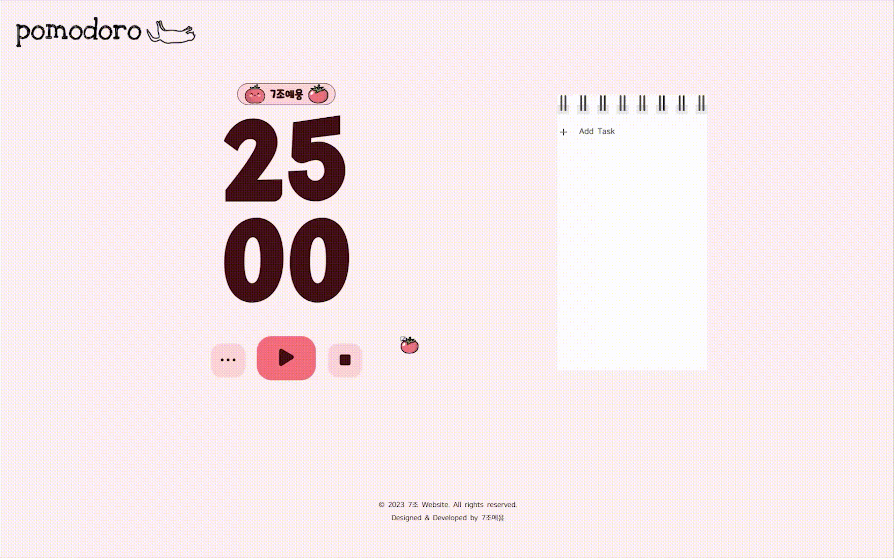

# 𝕡𝕠𝕞𝕠𝕕𝕠𝕣𝕠

> 이노베이션캠프(동북) 워밍업 2차 7조

### 🍅프로젝트 주제

**간단한 시간 & 할 일 관리 웹 사이트 제작 (aka. 뽀모도로)**

### 🙌개발 인원 & 역할

  <table>
    <tbody>
      <tr>
        <td align="center">
          <a href="https://github.com/hotcream3904">
            
             
            <b>최은지(팀장)</b>
          </a>
           
          개발일지 작성, Timer 부분 구현
        </td>
        <td align="center">
          <a href="https://github.com/solightnsalt">
            
             
            <b>김다솔</b>
          </a>
           
          노션 & README 정리, Timer 부분 구현
        </td>
        <td align="center">
          <a href="https://github.com/LOCA525">
            
             
            <b>박준영</b>
          </a>
           
          To-do 부분 구현, 데이터 연결
        </td>
        <tr />
        <td align="center">
          <a href="https://github.com/myeongjin99">
            
             
            <b>서명진</b>
          </a>
           
          Timer 부분 구현, 배포
        </td>
        <td align="center">
          <a href="https://github.com/heexohee">
            
             
            <b>정소희</b>
          </a>
           
          To-do 부분 구현
        </td>
        <td align="center">
          <a href="https://github.com/daaraam">
            
             
            <b>최수지</b>
          </a>
           
          To-do 부분 구현
        </td>
      </tr>
    </tbody>
  </table>

### 🔧사용 스택

    

### API

### 📝프로젝트 구성

#### 메인페이지(index.html)

##### 1️⃣ 재생

클릭 시 타이머가 시작되고 일시 정지 모양으로 전환되며, 그 상태에서 다시 클릭하면 지금 시간 그대로 타이머가 정지된다. 

공부 시간이 끝나면 자동으로 알람이 울리며, 휴식 시간은 5초부터 0초까지 알람이 지속되어 바로 공부를 시작할 수 있게 해주었다.

##### 2️⃣ 정지

클릭 시 공부 시간과 휴식 시간이 모두 초기화된다.

##### 3️⃣ 설정

••• 버튼을 누르면 셋팅창이 나타나고, 저장한 시간으로 타이머 시간이 변경된다.

##### 4️⃣ 할 일 등록

\+ Add Task 클릭 시 해당 영역이 `input[type="text"]`로 전환되며, 텍스트 입력 후 기록하기 버튼 클릭 또는 엔터 키 입력으로 등록 할 수 있다. 등록과 동시에 하단에 차례로 표시된다.

##### 5️⃣ 할 일 삭제

등록된 할 일을 완료하였을 때 DONE 버튼을 클릭하면 화면에서 지워진다.

### ✍🏻소감

##### 김다솔

변수 설정부터 하나하나 코드를 짜면서 처음 보는 오류도 마주치고 어떻게 시작해야 할지 감도 안 잡히는 부분도 있었지만 팀원들과 머리를 맞대고 차근차근 모두 해결해 내서 성취감이 뛰어났습니다💚

##### 박준영

##### 서명진

저희 조는 분업이 잘 되었고 또, 모르는 부분이 생기면 팀원들끼리 적극적으로 도와주었습니다. 부족한 부분이 많았는데 귀찮아하시지 않고 너무 잘 도와주셔서 진짜 너무 감사했습니다. 7조 최고

##### 정소희

자바스크립트 로직과 로컬스토리지에 대해 깊게 공부할 수 있었던 프로젝트 입니다! 멋진 팀원분들께 많이 배웠습니다. 감사해요😘

##### 최수지

바닐라 JS 만으로 원하는 기능을 넣어보니까 웹페이지 하나에 얼마나 많은 로직이 필요한지 느껴졌어요. 팀원분들과 함께여서 가능했던 즐거운 시간 ♪( 'ω' و)

##### 최은지

html과 css로 정적 홈페이지를 구현할 때까지만 해도 별다른 어려움을 느끼지 못했었는데, JS로 기능 구현을 하려고 하니 컴퓨터가 받아들이는 방식대로 로직을 짜는 게 많이 버겁게 느껴졌습니다. 그렇지만 다 함께 프로젝트 설계부터 마무리까지 하게 되니 너무 도움도 많이 되고 재미있었던 것 같아요!
